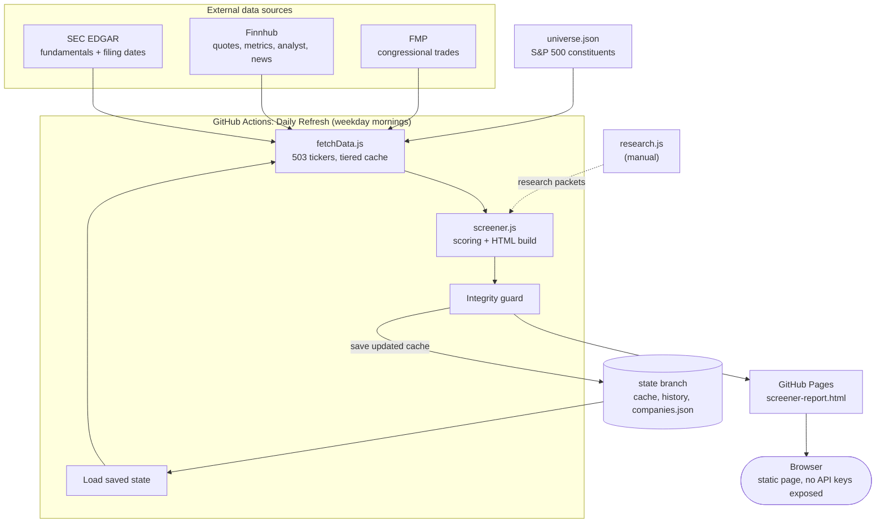

# Stock Screener

Two scripts:
- **screener.js** — grades and ranks stocks, makes the report
- **fetchData.js** — pulls real stock data from SEC EDGAR + Finnhub

Keep both in the same folder.

> **Provider status (2026-08-10):** FMP was retired to `backup/fmp.js` — it was
> quota-exhausted on every run and contributed zero real data once SEC/Finnhub
> became primary. Only `FINNHUB_API_KEY` is required now (SEC needs no key).
> See `backup/fmp.js`'s header comment for exactly how to re-enable it later.
> The rest of this file predates that change and the `.env`/`universe.json`
> setup that came before it - the quick summary below is stale in places.

---

## First: just see it work (no keys needed)

In Terminal:

```
cd ~/Downloads/Screener        # <- wherever this folder lives
node screener.js
```

This runs on built-in sample data. It prints a ranked list and creates
**screener-report.html** in the same folder. Double-click that file to
open the scoreboard in your browser.

---

## Then: feed it real stocks

1. Get two free API keys:
   - https://financialmodelingprep.com/
   - https://finnhub.io/

2. Give Terminal your keys (paste your real keys in):

   ```
   export FMP_API_KEY=your_fmp_key_here
   export FINNHUB_API_KEY=your_finnhub_key_here
   ```

   (Note: this lasts until you close Terminal. If you reopen it, run
   these two lines again.)

3. Pull the data, then grade it:

   ```
   node fetchData.js     # makes companies.json
   node screener.js      # grades the real data, updates the report
   ```

Once set up, the everyday routine is just those two commands.

---

## Change what it screens

- **Which stocks:** edit the `TICKERS` list at the top of `fetchData.js`
- **What matters most:** edit `BUCKET_WEIGHTS` at the top of `screener.js`
  (Value / Momentum / Quality / Sentiment / Risk — must add up to 1)

---

## Heads up

- Needs Node 18 or newer. Check with `node -v`.
- Each stock = 3 FMP calls + 2 Finnhub calls. FMP's free tier is ~250/day,
  so keep the ticker list under ~80 names until you upgrade or add caching.
- This ranks *candidates to research* — it is not investment advice.

---

## Architecture



### How the data pipeline works

Three providers feed the pipeline: SEC EDGAR supplies fundamentals (ROE,
debt/equity, growth, margins), Finnhub supplies live quotes, valuation
metrics, analyst consensus, and news sentiment, and FMP supplies only
congressional stock-trade disclosures. A GitHub Actions workflow runs on
weekday mornings, hydrates the latest cached state, runs `fetchData.js`
then `screener.js`, and publishes the resulting report to GitHub Pages.
Each data group is cached with its own freshness tier so a run doesn't
refetch everything every day: fundamentals stay fresh for a week,
quotes/valuation for about a day, and analyst/news for roughly 3.5 days,
so only the stale slice of the universe gets refetched on any given run.
A failed fetch never overwrites a good cached value — it's simply left
stale rather than falsely marked fresh, so a bad run self-heals on the
next one. Progress is also saved after every single ticker, so an
interrupted run doesn't lose whatever it already fetched. All of this
state — caches, history, research packets, and generated files — lives on
a separate orphan `state` git branch rather than `main`; each run hydrates
from it before fetching and pushes updates back afterward. The published
report itself is a single static HTML file with all data baked in at
generation time — no API keys or backend are ever exposed to the browser.

---

## Backtest

`scripts/reconstructScores.js` rebuilds what the composite score would have
been on each monthly rebalance date since 2024-10-01, using only data that
was actually knowable as of that date (SEC fundamentals selected by filing
date, prices from a Polygon backfill). `scripts/backtest.js` then runs a
simple strategy against those reconstructed scores: rebalance monthly, buy
the top 20 stocks by composite, equal-weighted, hold until the next
rebalance, benchmarked against SPY over the same dates using the same
entry/exit-price method. The results below cover the primary period
(January 2025 – September 2026, 20 completed monthly holding periods —
the window where the Momentum bucket is actually populated), shown both
without transaction costs and with a 10 bps round-trip cost assumption.

| | Total return | Max drawdown | Win rate vs SPY | Mean turnover |
|---|---|---|---|---|
| Strategy (0 bps) | 30.00% | -4.80% | 55% (11/20 months) | 3.9 / 20 holdings per rebalance |
| Strategy (10 bps) | 29.03% | -4.93% | 55% (11/20 months) | 3.9 / 20 holdings per rebalance |
| SPY (benchmark) | 30.30% | -6.57% | — | — |

### Limitations

- **Survivorship bias.** The universe is today's 503 S&P 500 constituents —
  companies that were removed from the index at any point during the
  backtest window are absent entirely, which tends to flatter historical
  performance versus what an investor actually holding the index over that
  window would have experienced.
- **80% of scoring weight reconstructed, not 100%.** The Sentiment
  (news + analyst) and Risk (beta) buckets can't be rebuilt historically —
  Finnhub only exposes a live snapshot for those, with no archive — so
  every reconstructed composite rests on Valuation, Quality, Growth, and
  Momentum only.
- **Point-in-time integrity, not point-in-time perfection.** SEC
  fundamentals are selected by each fact's `filed` date, never the
  reporting period date, so no filing is ever used before it was actually
  public — but `ret3m`/`ret6m` are a best-effort trailing-return analog
  from Polygon closes, not a guaranteed match to Finnhub's own undisclosed
  methodology.
- **Short sample, one market regime.** 20 completed months (January 2025 –
  September 2026) is not enough data to draw a statistically confident
  conclusion, and it covers a single market environment — there's no
  guarantee these results would hold across a recession, a rate-cut cycle,
  or a different sector-leadership regime.
